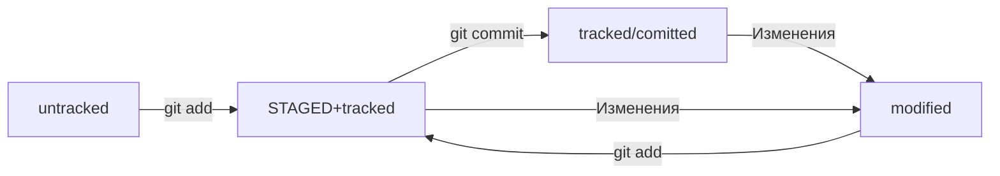

# Cheat Sheet GIT
_Самый базовый набор команд что тебе может пригодиться когда будешь работать с гитом_
----

- `git init` - создание репозитария, по сути в нужной паке генерируешь скрытую папку .git со всякими кишками  
- `git add _files_` - добавить файл(ы) к будущему коммиту. 
- `git add -all` - добавить все файлы в папке для подготовки к коммиту 
- `git restore --staged <filename>` - убираем файл из списка "подготовленных" к коммиту  
- `git restore --staged` - сброс ВСЕХ "подготовленных" к коммиту файлов обратно к untracked/modified  
- `git restore <filename>` - возврат файла обратно к его закомиченному состоянию или тому что было после git add *thisFilename*  
- `git reset` - Alternative_OLD] отменить все те добавления что были сделаны через add  
- `git reset my_file.txt` - Alternative_OLD] отменить из индексации только тот файл (или файлы) что передаются в команде  
- `bash git status` - посмотреть текущий статус репозитария, ВАЖНОЕ  
- `git commit -m "Мой важный комментарий для этого коммита"` - создаём коммит и при этом необходимо дать комментарий для будущего себя, максимально понятный и подробный 
- `git log` - посмотреть историю коммитов  
- `git push` - передать коммит в удаленный репозитарий  
- `git remote` - получить информацию о текущем удаленноых репозиториях, есть ли они?  
- `git remote add origin https://github.com/Colm1349/git-cheet-sheet-sludge.git` - пример подвязки репозитария локального к удаленному на GitHub'е. origin тут нужен , НЕ упускай его  
- `git remote -v` -  получить информацию о том какие удаленные репозитории подвязаны  
- `git push -u origin master` - запушить в удаленный репозитарий код с локальной репы, НО нужен хотя бы ОДИН коммит! 
- `git push` - закинуть изменения в удаленный репозиторий  

----
# Откаты и коммиты 
- `git reset --hard <commit hash>` - откатиться к коммиту с указанным ХЕШЕМ, те что были после него будут УДАЛЕНЫ. Крайне опасная команда, использовать только если очень надо  

### Приколы с откатом ПОСЛЕДНЕГО коммита
- `git commit --amend --no-edit` - по сути отредачить ПОСЛЕДНИЙ коммит (HEAD), позволяет добавить новые файлы к коммиту, НЕ меняем комментарий к коммиту так как используем опцию "--no-edit"  
- `git commit --amend -m "Актуальный комментарий к коммиту"` - позволяет изменить комментарий к ПОСЛЕДНЕМУ коммиту, удобно если опечатался или не до конца корректно описал суть изменения  

----

## Состояния/статусы файлов для гита
- **`untracked` -** неотследживаемый = Гит не смотрит на изменения этого файла, но сам файл типа видит.
- **`staged` -** подготовленный = Гит смотрит на этот файл, готов его “вкоммичивать”
- **`tracked`** - отслеживаемый = это файлы которые уже закомиченны и те что добавлены в staging area (подгготовленая полянка со staged файлами). Гит смотрит за изменениями именно таких файлов
- **`modified` -** измененный **=** это те файлы что были изменены. Сравнение идет с прошлой версией файла.

# Схема состояний файлов для Git'a

----